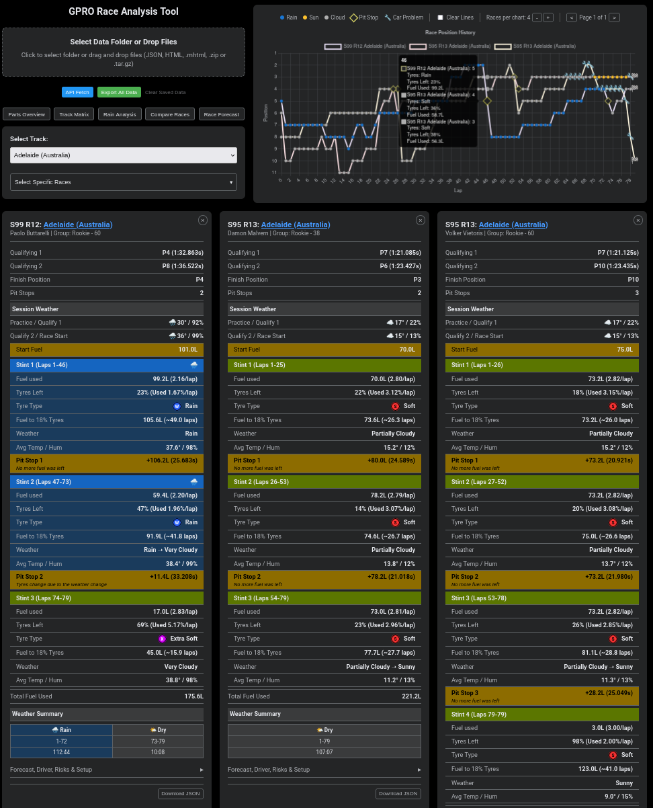
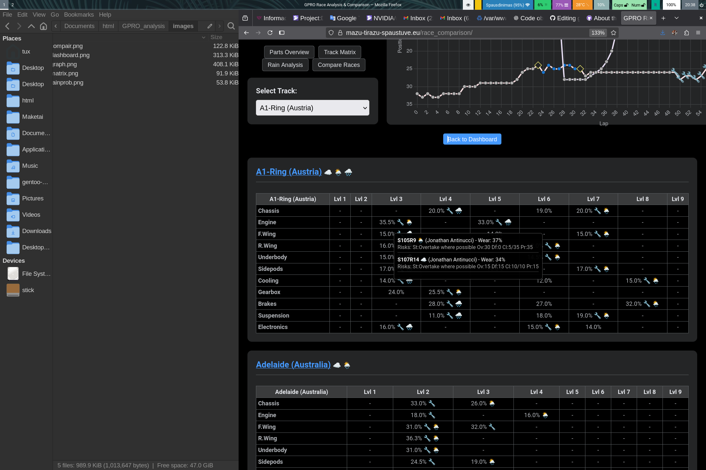
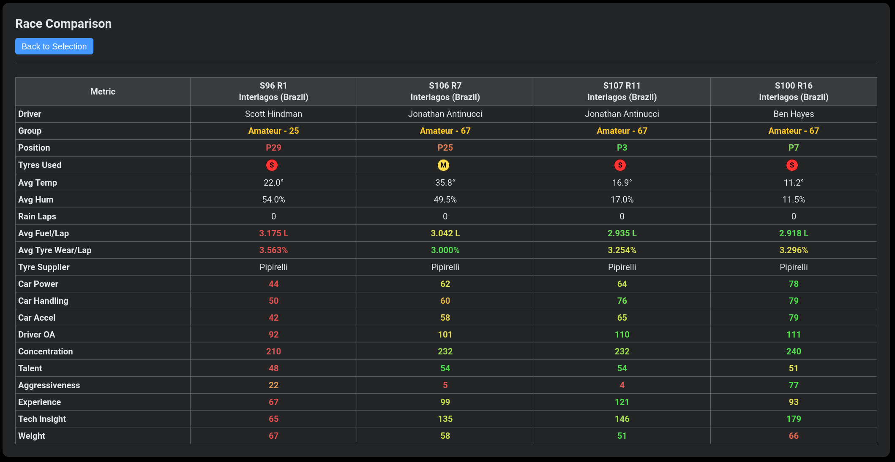
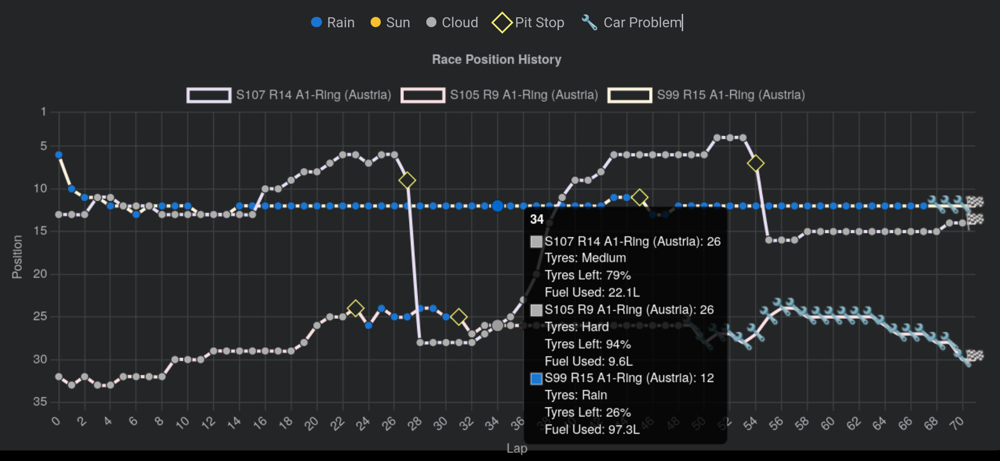
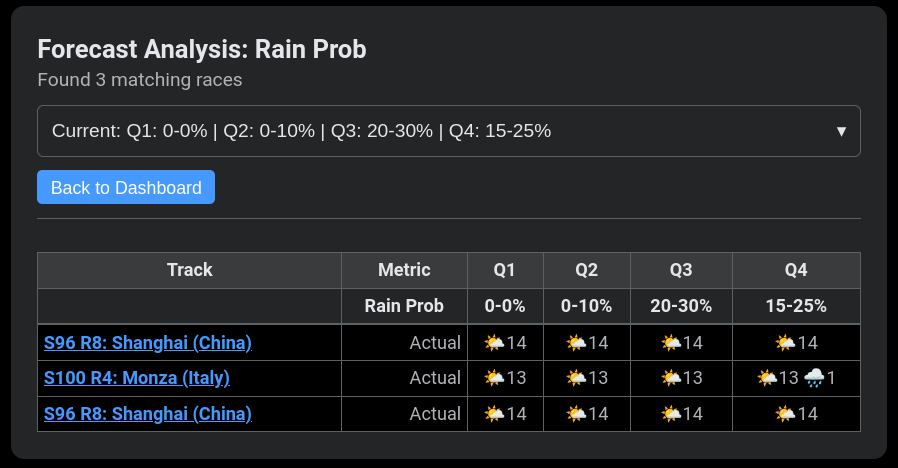

# GPRO Race Analysis Tool

A tool that extracts data saved to HTML and/or JSON files into a single workspace for easy analysis.

## Overview

This project is designed to collect HTML and JSON files that were previously saved from different sources and bring them together in one place.  
Once collected, the files can be inspected, processed, or analyzed using custom logic.

The focus is on **organization, simplicity, and extensibility**.

## Features

- Reads your Race Analysis saved in **HTML** and/or **JSON** files
- Extracts data into an easy to read tables
- You can easy compare races
- See fuel/tyres consumtion per section or lap
- Mobile friendly
- Works locally, no data is uploading to server

## Use cases

- See full data in cards with same tracks; easy to catch eye on important things
- Races analysis in graph
- Parts wearing overview by level or type or in tables for each track
- Rain probability analysing
- Copair selected races

## Screenshots

